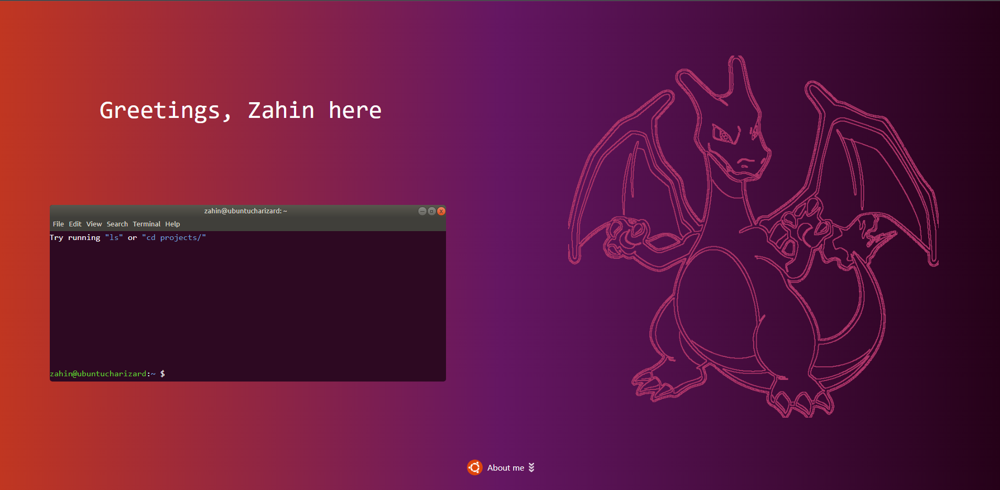

    

 

# My Broken Portfolio

This repository contains my portfolio website, it's design inspired by a Ubuntu theme. It showcases my projects, experiences and skills, as well as accepts endorsements from visitors, and more. Check it out [here!](https://zahin-zaman.vercel.app/)

## Tech Stack

The backend is a [Django](https://www.djangoproject.com/) application hosted as a [pythonanywhere](https://www.pythonanywhere.com/) application with a [SQLite3](https://www.sqlite.org/index.html) database. The frontend consists of a [React.js](https://reactjs.org/) application hosted as a [Vercel](https://vercel.com/) application, styled using [React Bootstrap](https://react-bootstrap.github.io/) and [Material UI](https://material-ui.com/).

